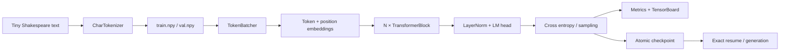

# miniGPT

> CPU-first GPT Training and Profiling Lab
> 从零实现、可复现、可断点续训、可性能分析的字符级 GPT 工程。

**Python 3.11–3.14 · PyTorch CPU · Windows-first + Linux CI · Strict typing · Exact resume**

## 项目概览

miniGPT 是一个面向学习、工程实践和简历展示的字符级 GPT 项目。它没有调用现成的
Transformer 模型，而是从张量运算开始实现 LayerNorm、因果多头自注意力、MLP、
Transformer Block、语言模型损失与自回归采样，并把数据、训练、断点恢复、指标、
TensorBoard、基准测试和 PyTorch Profiler 串成一条可验证的工程链路。

完整的项目背景、系统架构、模块说明和 Stage 1–18 演进见 [项目技术白皮书](docs/PROJECT_OVERVIEW.md)。

项目优先解决三个问题：

- **模型原理可解释**：关键网络结构均在 `src/minigpt/` 内实现，张量形状与因果遮罩清晰可查。
- **实验可以复现**：checkpoint format v2 保存完整实验定义、模型、优化器、完成步数、
  Python/NumPy/PyTorch 全局 RNG、train/val batcher RNG 和独立 sample generator RNG。
- **性能可以测量**：基准测试区分预热与计时，输出重复测量、吞吐、离散程度和内存；
  Profiler trace 可以在 Chrome Trace 或 Perfetto 中检查算子级时间线。

当前范围是单机 CPU、字符级 tokenizer 和教学规模 GPT。它不是分布式训练框架，也不以
替代成熟 LLM 训练栈为目标。

## English Summary

miniGPT is a CPU-first character-level GPT training lab implemented with PyTorch. It includes a
hand-written Transformer stack, deterministic data preparation, YAML-driven experiments, exact
checkpoint resume, JSONL metrics, TensorBoard logging, repeatable CPU benchmarks, and PyTorch
Profiler traces. The repository is intentionally small enough to study end to end while keeping
production-minded boundaries: Python 3.11 through Python 3.14, strict static typing, explicit
serialization validation, and the same four quality gates on Windows and Linux CI.

## 功能与边界

已实现：

- 字符词表构建、encode/decode、90/10 数据切分及 SHA-256 元数据。
- 自定义 LayerNorm、causal self-attention、MLP、pre-norm residual blocks。
- AdamW 参数分组、线性 warmup、余弦衰减和梯度裁剪。
- 验证集评估、定期采样、JSONL 指标与 TensorBoard。
- checkpoint format v2、SHA-256 数据身份校验与 bit-exact 训练恢复。
- 训练恢复、独立生成 CLI、CPU benchmark 和 operator profiler。
- Ruff `ALL`、basedpyright `all` 与严格 pytest。

明确不包含：

- GPU/CUDA、混合精度、DDP/FSDP 或多机训练。
- BPE/SentencePiece tokenizer、预训练权重下载或聊天微调。
- 面向生产服务的推理 API。

## 环境要求与安装

- Windows 11 / PowerShell 是主要开发环境；GitHub Actions 同时验证 Linux。
- **Python 3.11、3.12、3.13 或 3.14**；`pyproject.toml` 声明 `>=3.11,<3.15`。
- CPU 版 PyTorch 2.12 或项目声明的兼容版本。

```powershell
python --version
python -m pip install -e ".[dev]"
python -m pip check
```

依赖全部定义在 `pyproject.toml`；空的 `requirements.txt` 不是安装入口。发行包名是
`minitrain-gpt`，Python import 名是 `minigpt`。

## Quick Start

五分钟 smoke 流程：

```powershell
python prepare_data.py --data-dir data
python train.py --config configs/char_gpt_smoke.yaml
python generate.py --checkpoint checkpoints/smoke/latest.pt --prompt "ROMEO:" --max-new-tokens 16 --seed 1337
```

对应的轻量配置见
[训练 smoke 配置](configs/char_gpt_smoke.yaml)；第一次运行数据命令会下载 Tiny
Shakespeare，之后复用 `data/raw/input.txt`。

### Reference training 证据

[CPU reference training 自动生成报告](docs/results/reference-training/README.md)记录了一次
CPU-only、2800-step 的完整训练：它使用固定 canonical 配置，经过一次 checkpoint v2
中断恢复，并提交了环境清单、resolved config、逐步 metrics CSV、未润色样本、三张图和
artifact manifest。checkpoint 二进制不进入 Git；报告用 SHA-256 绑定本地 checkpoint、
数据、tokenizer、配置和原始训练日志。

这份结果用于证明训练链路可复现、可审查，不是硬件 benchmark，也不声称小型字符模型
已经具备通用语言能力。

## 数据准备

```powershell
python prepare_data.py --data-dir data
python prepare_data.py --help
```

CLI 调用 `minigpt.data.prepare_tiny_shakespeare`，生成：

```text
data/
├── raw/input.txt
└── processed/
    ├── train.npy
    ├── val.npy
    ├── tokenizer.json
    └── metadata.json
```

为了离线测试，也可以传入本地 `file://` URL：

```powershell
python prepare_data.py --data-dir data/local --source-url "file:///D:/corpus/input.txt"
```

## 训练、恢复与生成

完整训练：

```powershell
python train.py --config configs/char_gpt.yaml
```

短训练：

```powershell
python train.py --config configs/char_gpt_smoke.yaml
```

临时运行到绝对边界 `K`（exclusive；执行 step `0` 到 `K - 1`）：

```powershell
python train.py --config configs/char_gpt.yaml --run-until-step 250
```

使用同一份完整实验配置继续到另一个运行边界：

```powershell
python train.py --config configs/char_gpt.yaml --resume checkpoints/char_gpt/latest.pt --run-until-step 500
```

生成文本：

```powershell
python generate.py --checkpoint checkpoints/smoke/latest.pt --prompt "ROMEO:" --max-new-tokens 64 --temperature 0.8 --top-k 20 --seed 1337
python generate.py --checkpoint checkpoints/smoke/latest.pt --prompt "ROMEO:" --max-new-tokens 64 --temperature 0.8 --top-k 20 --seed 1337 --cached
```

默认命令保留逐 token 完整 forward 的 uncached baseline；显式 `--cached` 使用 prompt prefill、
增量 decode 和 caller-owned KV cache。超过 learned absolute-position `block_size` 后会重新
prefill 最新窗口，以保持与 baseline 相同的位置重编号和采样结果。

配置中的 `training.max_steps` 是完整实验计划，`training.lr_decay_steps` 是独立的学习率
调度 horizon；`--run-until-step` 只决定本次进程在哪里退出，不改写 checkpoint 中的实验
定义。validation 和 sample 仅由全局绝对 step 与各自 interval 触发。正常进程退出会保证
保存 checkpoint，但不会为了退出额外运行 validation 或 sample。

checkpoint format v2 使用临时文件后原子替换，至少保存并验证：

- model state、optimizer state、`completed_step` 和完整解析配置；
- Python、NumPy、PyTorch 全局 RNG；
- train batcher、validation batcher 和独立 sample generator RNG；
- `tokenizer.json`、`train.npy`、`val.npy` 的 SHA-256 fingerprint；
- checkpoint format version。

恢复前会比较模型、tokenizer/vocabulary、数据身份、batch/block size、AdamW 参数、
learning-rate schedule、`lr_decay_steps`、seed 和其他影响训练轨迹的配置。输出/TensorBoard
目录、日志与 checkpoint 频率可以改变。由于采样使用独立 generator，`sample_interval`、
`sample_tokens` 和 `sample_prompt` 的变化不会改变模型参数轨迹，但会改变样本文件内容和
后续样本流。

| Checkpoint | 读取配置 | 加载模型/生成 | 恢复训练 |
|---|---:|---:|---:|
| v1 | 支持（补齐确定性的旧字段默认值） | 支持 | 禁止，抛 `LegacyCheckpointResumeError` |
| v2 | 支持 | 支持 | 支持，先严格验证配置与数据身份 |

本阶段不提供 v1 的“尽力迁移”或不精确恢复开关；v1 仅用于推理。

## TensorBoard 与训练产物

```powershell
tensorboard --logdir outputs/smoke/tensorboard
```

默认 smoke 训练会写入：

- `outputs/smoke/metrics.jsonl`：loss、learning rate、step timing、tokens/s、RSS。
- `outputs/smoke/samples.txt`：按配置周期生成的文本。
- `outputs/smoke/tensorboard/`：TensorBoard event files。
- `checkpoints/smoke/latest.pt`：最新可恢复 checkpoint。

这些运行产物均被 `.gitignore` 排除，避免把本机实验结果误提交为源码。

## 配置说明

[完整训练配置](configs/char_gpt.yaml) 分为五个部分：

| Section | 作用 |
|---|---|
| `runtime` | seed、CPU 线程数和设备 |
| `data` | token 文件目录、block size、batch size |
| `model` | layer/head/embedding/dropout/bias |
| `optimizer` | `type: adamw`、学习率范围、betas、weight decay、grad clip |
| `training` | `max_steps`、`lr_decay_steps`、评估/日志/checkpoint/sample 周期和输出目录 |

`model.vocab_size` 可以为 `null`，训练时会从 `tokenizer.json` 解析并校验；checkpoint
保存的是已经解析的完整配置。

## 核心架构



每个 TransformerBlock 使用 pre-norm：

```text
x = x + CausalSelfAttention(LayerNorm(x))
x = x + MLP(LayerNorm(x))
```

注意力遮罩注册为 non-persistent buffer；checkpoint 不重复存储可由配置重建的下三角矩阵。

## 性能分析

### Benchmark v1 与 v2

`benchmark.py` 是保留的 **v1 legacy/descriptive** 入口，用于既有教学 smoke 矩阵和历史
描述；它不是新的回归基线格式。新的 CPU 测量、可审查证据和候选比较应使用 **Benchmark
v2**：[`benchmark_v2.py`](benchmark_v2.py)。v2 的设计和实施边界见
[Stage 7B design](docs/superpowers/specs/2026-07-28-stage7b-cpu-benchmark-v2-design.md) 与
[Stage 7B plan](docs/superpowers/plans/2026-07-28-stage7b-cpu-benchmark-v2.md)。

v2 的配置显式列出 case，而不是展开隐式 Cartesian product；每个
`case × replicate` 都在一个 fresh process 中顺序执行，因此不会复用模型、optimizer、
PyTorch 线程池或进程 RSS。`benchmark_seed` 决定 case/replicate 的随机执行顺序；每个
worker 的实际 PID、顺序和状态都会保存在证据包中。

Windows 的项目虚拟环境可以使用下列命令；在其他受支持的平台将
`.\\.venv\\Scripts\\python.exe` 替换为当前环境的 `python`。

```powershell
.\.venv\Scripts\python.exe benchmark_v2.py --config configs/benchmark_v2_smoke.yaml
```

[v2 smoke 配置](configs/benchmark_v2_smoke.yaml) 是 correctness-only 的小型合同：一个 tiny
模型、两个明确的 intra-op thread cases（1 和 2）、每 case 两个 replicate、一次 warmup
和两个 measured steps。它的输出目录是 gitignored 的 `reports/benchmark-v2/`；该命令产出的
数字不是已提交的性能结果，也不应用来排名机器。

### Canonical v2 method

每个 worker 先应用并读回可选 `cpu_affinity`，再设置该 case 的 **intra-op**
`torch_num_threads` 和配置级别的 **inter-op** `torch_num_interop_threads`，最后才构建
workload；inter-op 不是每个 case 的变量。线程设置在 fresh process 中完成，避免 PyTorch
在已经并行运行后不能安全重设 inter-op 线程数的问题。在 hybrid CPU 上应谨慎使用 affinity：
只在确认 logical IDs、P/E-core 拓扑和系统允许设置 affinity 后才固定它。

先运行 `warmup_steps`，再垃圾回收并临时禁用 GC。唯一 canonical timer 是一个
`time.perf_counter()` 区间，包含完整 measurement loop 的 batch acquisition、
`optimizer.zero_grad(set_to_none=True)`、forward/cross-entropy loss、backward、gradient
clipping 和 optimizer step。它明确排除 worker startup/import、CPU/environment/thread setup、
model/optimizer/batcher construction、warmup、pre-timer GC、post-timer memory/environment reads、
JSON transport、logging/report I/O、profiler instrumentation、checkpoint、validation 和 text
generation。不要把 profiler 或额外 phase timers 包进该 timer。

`final_rss_mib` 是 canonical loop 结束后读取的 RSS。worker lifetime peak RSS 显式记录为
`peak_rss_scope: worker_lifetime`；`peak_rss_mib` 是 OS-native、整个 worker 生命周期的高水位
（Windows peak working set 或 Linux `getrusage` `ru_maxrss`）。它包含 import、construction、
warmup 和 measurement，因而不是 measurement-only 或 model-only memory；两者也没有 polling
thread，`peak_rss_sampling_interval_ms` 为 `null`。

每个成功 replicate 贡献一个聚合 `step_time_ms`。v2 保留全部
`raw_replicates.jsonl` 记录，包含失败记录及其 stdout/stderr；不会自动删除或过滤任何 outlier。
每 case 的 `summary.csv` 计算 median、min、max、population standard deviation (`pstdev`)、MAD 和
CV，以及 median throughput、median final RSS 与 max native peak RSS。少于
`minimum_replicates` 个成功样本为 `insufficient_samples`；否则 CV 严格大于 `max_cv_percent`
为 `unstable`，不大于该阈值为 `stable`。温度、电源策略、后台负载、CPU 频率和
PyTorch/BLAS 版本均可能造成漂移，所以先看 raw replicate、CV 和环境证据，再讨论差异。
这些 run config 字段只描述生成该 run 时的报告规则；它们不是 baseline/candidate verdict 的
权威 policy。

一个完成或 partial run 的目录包含 `run_manifest.json`、`environment.json`、
`resolved_config.yaml`、`execution_order.json`、`raw_replicates.jsonl`、`summary.csv` 与
`summary.md`。manifest 将每个非自身 artifact 的 run-relative path、byte size 和 SHA-256 绑定；
environment 记录 Git、platform/CPU、Python/PyTorch/NumPy、power scheme、priority、相关环境变量
和每个成功 worker 的有效控制。字段及严格加载规则见
[artifact/report schema](src/minigpt/benchmark_v2_report.py)。报告、raw runs、trace 和机器特定
数字都被 gitignore，不能作为源码或默认基线提交。

Benchmark v2 schema v3 还把可选的 training-step preconditioning 绑定进 resolved config、
methodology identity 和最终 manifest；启用时，benchmark 命令会先执行并记录该阶段，再开始
worker replicates。这样复现命令不会依赖未记录的手工预热。

### Portable reference and calibrated Stage 8 methodology

以下命令必须在同一台空闲机器、相同电源策略、相同 Python/PyTorch/NumPy 与相关环境变量下执行：

```powershell
.\.venv\Scripts\python.exe benchmark_v2.py `
  --config configs/benchmark_v2_i7_14700_stage8.yaml
```

[portable reference 配置](configs/benchmark_v2_reference.yaml) 保留通用 teaching matrix，
不固定 affinity，也不启用主机专属 preconditioning。明确命名的
[i7-14700 Stage 8 配置](configs/benchmark_v2_i7_14700_stage8.yaml) 才承载该 Windows 主机
校准的方法：15 warmup、200 measured steps、7 replicates、logical CPUs `0..15`，以及命令内
执行并记录的 120 秒 training-step preconditioning。它声明 10 个 one-factor cases：
shared baseline 一次、threads 1/4/8/12/20、block size 64/128/256 和 batch size
4/8/16/32；不是完整矩阵。其它 CPU 拓扑不能直接复用该 affinity，必须重新校准。

[comparison policy](configs/benchmark_v2_comparison.yaml) 的保守初值要求至少 5 个成功
replicate、CV 不高于 5%、step-time regression 严格高于 7.5%，并要求两侧 raw replicate
数量相同。这些值不声明具有统计显著性；Stage 8 在同机、同代码、同配置上独立运行两次
baseline，观察到每 case step-time 漂移 -3.29% 到 +6.58%，随后才运行 candidate。

### Stage 8 batcher / mmap evidence

[`benchmark_batcher.py`](benchmark_batcher.py) 是严格隔离的 batch-only 工具：每个 replicate
使用 fresh process 和只读 `uint16` mmap，只计时 `TokenBatcher.next_batch()`；它不能代替
完整训练 benchmark。

```powershell
.\.venv\Scripts\python.exe benchmark_batcher.py `
  --config configs/batcher_benchmark_i7_14700_stage8.yaml
.\.venv\Scripts\python.exe profile_benchmark_v2.py `
  --config configs/benchmark_v2_stage8_profile.yaml
```

[portable batch-only 配置](configs/batcher_benchmark_reference.yaml) 同样不固定 affinity；
上面的 i7-14700 配置才是当前主机复测定义。[Stage 8 精简证据包](docs/results/batcher-optimization/README.md)
保存交错执行的 baseline A、candidate A、baseline B、candidate B 全部小型 raw JSONL，
strict run manifests 和六份 comparison JSON。四种 case 中，两组 candidate 的描述性中位数
都低于两组 baseline，但所有严格 comparison 都因至少一侧 CV 超过 5% 而
`not_comparable`，所以当前不声称已经稳定证明 batch-only 提速。

### Stage 9 KV-cache inference evidence

[`benchmark_inference.py`](benchmark_inference.py) 独立测量 cached/uncached 生成，不复用训练
step timer，也不把 Profiler 时间当吞吐。canonical matrix 覆盖 prompt 16/32/64/128、生成
8/32/64、batch size 1；每个 mode/case 的 replicate 都在独立进程中使用固定权重和 forced
tokens，并记录 prefill/TTFT、median decode latency、tokens/s、端到端延迟、worker-lifetime
peak RSS 和 KV-cache bytes。

```powershell
python benchmark_inference.py --config configs/inference_benchmark_stage9.yaml
python profile_inference.py `
  --config configs/inference_benchmark_stage9.yaml `
  --output reports/inference-profile-stage9/profile-p128-g32.json
python generate_stage9_evidence.py --verify
```

[Stage 9 证据包](docs/results/kv-cache-generation/README.md) 绑定 168 个 raw replicate、resolved
config、环境、执行顺序、summary 和独立 profiler。12 个 case 的 cached 描述性端到端中位数
都较低，但 5 个 case 的 CV 超过 5%，因此总体 strict verdict 是 `not_comparable`；报告不将
描述性差异升级为整体性能提升结论。

### Stage 10 MiniServe serving control plane

Stage 10 在现有 `GPT.prefill()`、`GPT.decode()` 与 KV cache 之上增加多请求控制面：严格
FIFO waiting queue、请求状态机、active/cache admission、最坏情况 cache token reservation、
取消与背压、失败隔离、独立 sampling RNG，以及 TTFT、TPOT、queue time、E2E 和吞吐记账。
每个 tick 依次处理 cancellation、admission、prefill 和 decode；每个 active request 每轮最多
产生一个 token，终态立即释放 cache reservation。

```powershell
python simulate_serving.py --config configs/serving_single_request.yaml
python simulate_serving.py --config configs/serving_burst_arrivals.yaml
python simulate_serving.py --config configs/serving_cache_pressure.yaml
python generate_stage10_evidence.py --verify
```

当前 `ReferenceExecutor` 仍逐请求调用模型。多个请求在同一 iteration 被推进只表示控制面
co-scheduling，不是张量级 continuous batching，也不构成吞吐提升声明。三个固定场景及
`events.jsonl`、`requests.csv`、`summary.json`、`timeline.md` 见
[Stage 10 证据包](docs/results/serving-control-plane/README.md)。Stage 11 才考虑真正的 batch
assembly/scatter 与 batched KV-cache executor，并须对照 reference executor 做语义等价测试。

### Stage 11A decode continuous batching

Stage 11A 保留 Stage 10 的请求状态机、FIFO admission、cache reservation、取消、事件和
request metrics，只增加 `ContinuousDecodeExecutor`：prefill 仍逐请求运行；同一 tick 内合法且
未 overflow 的 decoding 请求会组装为右侧补零的 dense KV batch，一次执行 single-token decode，
再按真实 cache length scatter 回紧凑的 per-request cache。每行使用自己的 learned-position
offset、sampling 参数和 `torch.Generator`；坏 cache 只失败所属请求，block-size overflow 继续走
Stage 9 sliding-window re-prefill。

```powershell
python simulate_serving.py `
  --config configs/serving_stage11a_mixed.yaml `
  --compare-executors
python benchmark_serving.py --config configs/serving_benchmark_stage11a.yaml
python profile_serving.py `
  --config configs/serving_benchmark_stage11a.yaml `
  --scenario mixed-cache-lengths `
  --executor continuous_decode `
  --output reports/serving-profile-stage11a/mixed
python generate_stage11a_evidence.py `
  --benchmark-run reports/serving-benchmark-stage11a/<run-id>
```

[Stage 11A 证据包](docs/results/decode-continuous-batching/README.md) 绑定 60 个 fresh-process
replicate、交替执行顺序、环境、resolved config、raw measurements、simulator 双 executor 输出和
SHA-256。固定 CPU 小模型的六个场景全部满足 correctness 与 CV 门槛，strict verdict 为 `pass`；
continuous median wall time 的 reference/continuous 比值约为 1.24×–2.22×。mixed-cache 场景
padding waste 为 35.43%，说明 dense padding 的吞吐收益并非免费。本阶段不是 batched prefill、
paged attention 或 HTTP serving，Profiler 时间也不参与 canonical 性能结论。

### Stage 11B length-bucketed batched prefill

Stage 11B 新增 `ContinuousExecutor`，同时复用 Stage 11A batched decode。当前 tick 已 eligible 的
`PREFILLING` 请求按严格 FIFO 连续前缀贪心分组；`max_batch_size`、`max_batch_tokens` 和
`max_padding_ratio` 限制 dense prompt padding，不会绕过队首或等待未来请求。模型接口接收
right-padded `[B,Tmax]` 与逐行真实长度，通过 causal/key-valid mask 保持 learned absolute
position 语义，再将每层 cache scatter 为 `[1,H,L,D]`。

```powershell
python simulate_serving.py `
  --config configs/serving_stage11b_mixed.yaml `
  --compare-executors
python benchmark_serving.py --config configs/serving_benchmark_stage11b.yaml
python profile_serving.py `
  --config configs/serving_benchmark_stage11b.yaml `
  --scenario burst-mixed-lengths `
  --executor continuous `
  --output reports/serving-profile-stage11b/mixed
python generate_stage11b_evidence.py `
  --benchmark-run reports/serving-benchmark-stage11b/<run-id>
```

三方 simulator 分别运行 `reference`、`continuous_decode` 和 `continuous`，比较 token、终态、
取消、FIFO admission、cache accounting、逻辑请求事件与 request metrics。Prefill batch events
和 executor timing 单独记录。Prompt padding 会为所有 padded query 重复 attention/MLP 工作，
通常比单 token decode cache padding 更昂贵；因此 benchmark 主要比较
`continuous_decode` 与 `continuous`，并同时报告 throughput、TTFT、queue time 与 peak RSS。
本阶段仍是 dense batching，不是 paged attention。

### Stage 12 OpenAI-compatible HTTP serving

Stage 12 用可选的 FastAPI/Uvicorn 依赖把 Stage 10 FIFO scheduler 与 Stage 11 executors 暴露为
`GET /healthz`、`GET /v1/models` 和 `POST /v1/completions`。训练核心不会强制依赖 Web 框架；
checkpoint、tokenizer、config 与 model 只在启动时加载一次。async HTTP handler 通过线程安全
command queue 提交给专用 `EngineRunner`，只有该线程可以调用 `ServingEngine.tick()` 与 model。

```powershell
python -m pip install -e ".[serve]"
python serve.py `
  --checkpoint checkpoints/reference.pt `
  --tokenizer data/processed/tinyshakespeare_char/tokenizer.json `
  --host 127.0.0.1 `
  --port 8000 `
  --executor continuous
```

`stream=true` 每 token 发送一个 SSE chunk，正常结束才发送最终 usage/finish reason 与
`data: [DONE]`。每个 stream 使用有界 channel；慢消费者溢出或 client disconnect 只取消对应
request，并由现有 scheduler 释放 KV reservation，不阻塞其他 decode。当前只接受 `model`、
`prompt`、`max_tokens`、`temperature`、`stream`、`seed`；其他 OpenAI 参数会明确拒绝。

[`benchmark_server.py`](benchmark_server.py) 独立测量 HTTP validation、serialization、queue、
scheduler 与 engine 的端到端 TTFT/TPOT/E2E、P50/P95/P99；它不替代 Stage 11 executor 隔离
benchmark，也不建立跨机器性能结论。curl/SSE、并发、取消/背压和 canonical localhost matrix
见 [Stage 12 证据包](docs/results/http-serving/README.md)。

### Stage 13A/13B paged KV cache 与 block-aware decode

Stage 13A 保留 `dense` reference backend，并新增固定 K/V block pool、per-request block table、
block reservation、事务化 prefill/append/overflow rebuild，以及 finish/cancel/failure/shutdown
零泄漏回收。普通 Stage 13A decode 会先把 block table 临时 materialize 成 compact dense cache，
因此不是 PagedAttention，也不预设更快。7 个固定容量/回收/碎片场景、3000 步 allocator stress
和 hash-bound 结果见 [Stage 13A 证据包](docs/results/paged-kv-cache-manager/README.md)。

Stage 13B 的 `paged_attention` executor 在正常单 token decode 中直接遍历有序 physical block
views：只拼接 attention score 做全序列 softmax，再逐 block 累加 value context；历史 K/V 不再
compact materialize 或 dense padding。模型只返回当前 token 的 per-layer K/V delta，由 pool
事务化 append。初始 prefill 和 learned-position overflow re-prefill 仍保持 dense reference 语义。
Stage 13A/13B 当前均为 Python/PyTorch reference implementation；这里没有高性能 fused
PagedAttention kernel，也不据此宣称性能提升。

```powershell
python serve.py `
  --checkpoint checkpoints/reference.pt `
  --tokenizer data/processed/tinyshakespeare_char/tokenizer.json `
  --executor paged_attention `
  --kv-cache-backend paged `
  --kv-block-tokens 16

python simulate_serving.py --config configs/serving_paged_attention.yaml
python benchmark_paged_attention.py --output reports/paged-attention/benchmark.json
```

dense、Stage 13A materialized paged 和 Stage 13B direct paged 在固定 workload 下保持 token、终态、
取消、FIFO、逻辑事件、request metrics 与 cache accounting 等价。canonical CPU 测量仅为当前机器
描述：direct E2E 中位数略慢于 materialized reference，虽然 block-view cache access 更轻；证据因此
明确标记 `descriptive_only`，不宣称 speedup。完整 correctness hashes、timings 与 caveat 见
[Stage 13B 证据包](docs/results/paged-attention/README.md)。

### Stage 14 Automatic Prefix Caching

Stage 14 在 Stage 13 paged block pool 上增加 namespace-bound Automatic Prefix Caching。
cache identity 绑定 checkpoint、model config、dtype/device、block size、schema version 与
learned absolute-position semantics；full token blocks 使用包含 parent hash 的 SHA-256 chain，
因此 block 身份同时绑定全部历史 prefix 与绝对逻辑位置，并保留 token metadata 做 collision 防御。

admission 查找 longest contiguous full-block prefix，把 canonical immutable SHARED block ID
附到 request block table 并增加 active refcount。suffix prefill 只计算未命中 tokens，从真实绝对
position 开始，直接 attention 到 shared prefix 与 earlier suffix K/V；不会重新执行命中 prefix 的
Transformer work。partial tail 始终 PRIVATE，本阶段没有 partial-block sharing/COW。zero-ref cache
按 deterministic LRU 在 pool pressure 下 eviction，active shared block 永不 eviction。

```powershell
python simulate_serving.py --config configs/serving_automatic_prefix_cache.yaml
python benchmark_prefix_cache.py --output reports/automatic-prefix-caching/benchmark.json
```

dense、materialized paged、direct paged 与 direct paged + APC 的 generated tokens、RNG、终态、
admission 和逻辑 request events 等价。5000 次 deterministic allocator/refcount stress 每次 mutation
都验证 invariant。fresh-process benchmark 覆盖六类 workload，并记录 hit ratios、reused blocks、
evictions、实际 prefill tokens、avoided prefill tokens、TTFT、E2E、req/s、tokens/s 与 peak RSS。
当前 strict verdict 为 `fail`，所以不宣称 wall-clock performance improvement；avoided prefill tokens
只证明计算工作被跳过。实现仍是 Python/PyTorch reference，不是 fused PagedAttention kernel。
完整 hash-bound 证据见 [Stage 14 证据包](docs/results/automatic-prefix-caching/README.md)。

### Stage 19 production serving configuration + runtime manifest

Stage 19 把 Stage 15–18 的 scheduler 与 paged-cache 控制项作为显式、经过校验的 `serve.py`
输入暴露给真实 HTTP 进程，同时保持 legacy dense/continuous 服务不变：默认没有 token budget、
没有 preemption、没有 lazy reservation、ratio 固定为 `1.0`，APC prefill 默认 sequential。completion
请求 schema 完全不变，`serve.py` 保持为薄 parser/Uvicorn 边界；typed policy 解析、
SchedulerConfig/paged pool/APC strategy/executor/engine/runner 构造、确定性 runtime manifest 构造
与原子 UTF-8/LF manifest 写入由 `src/minigpt/serving_runtime.py` 拥有。

```powershell
python serve.py `
  --checkpoint checkpoints/reference.pt `
  --tokenizer data/processed/tinyshakespeare_char/tokenizer.json `
  --executor paged_attention `
  --kv-cache-backend paged `
  --kv-block-tokens 16 `
  --kv-num-blocks 64 `
  --max-scheduled-tokens 128 `
  --prefill-chunk-tokens 16 `
  --kv-preemption `
  --lazy-kv-reservation `
  --kv-overcommit-ratio 2.0 `
  --runtime-manifest outputs/stage19-runtime-manifest.json
```

校验复用 simulator 使用的 scheduler/engine invariants：budget 与 chunk 必须成对出现；chunked
scheduling 要求 direct paged attention、block 对齐和最小 budget；preemption 要求 Stage 16；lazy
reservation 要求 preemption 与 direct paged attention；overcommit ratio 必须是有限的、不小于 `1.0`
且在 lazy mode 之外恒为 `1.0`；prefix caching 要求 direct paged attention；batched APC prefill
要求 prefix cache 且保持 opt-in。runtime manifest 是确定性、portable 的 JSON（不含绝对路径、
时间戳、hostname、PID 或 secrets），只在 runtime 构造成功后原子替换写入。
[示例配置](configs/serving_http_lazy_kv.yaml) 记录了同样的 flag 组合；证据生成入口是
`python generate_stage19_evidence.py --source-commit <sha>`。Stage 19 verdict 为
`descriptive_only`，不声称 wall-clock 性能提升，也不声称生产环境安全就绪。

### Compare compatible v2 evidence

用 [`compare_benchmarks.py`](compare_benchmarks.py) 比较两个完成的 `run_manifest.json`：

```powershell
.\.venv\Scripts\python.exe compare_benchmarks.py `
  --baseline reports/benchmark-v2/<baseline-run>/run_manifest.json `
  --candidate reports/benchmark-v2/<candidate-run>/run_manifest.json `
  --policy configs/benchmark_v2_comparison.yaml
```

policy 使用严格、拒绝重复 key 的 schema v1。比较器从 baseline 和 candidate 的
`raw_replicates.jsonl` 在同一 policy 下重新计算样本 eligibility 和 stability；任一 run 自己
声明的 `replicates`、`minimum_replicates`、`max_cv_percent` 或
`regression_threshold_percent` 都不能放宽 verdict。比较按剔除展示名称后的
`case_identity` 对齐，并拒绝 incomplete run、缺失/额外 case、样本不足、policy 要求下的
replicate 数不一致或 `unstable`，以及 CPU/toolchain/power-scheme/relevant environment
variables/worker controls/methodology 不兼容的证据。

即使 verdict 是 `not_comparable`，输出仍保留 descriptive deltas；它们不是性能结论。只有
兼容且 `stable` 的 cases 才会得到 pass/fail。candidate step time 相对 baseline
**strictly greater than** policy 的 `regression_threshold_percent` 才是 regression；恰好等于
阈值不是 regression。比较不会过滤 outlier，也不修改来源 run。JSON/Markdown 同时保存 policy
摘要、policy SHA-256 和由两份 manifest hash 与 policy hash 派生的 comparison identity；修改
policy 文件会生成不同 identity 和输出文件名。

默认 CLI 退出码适合自动化回归门禁：

- 0 = `pass`
- 1 = 输入、schema、I/O 或证据损坏
- 2 = `fail`
- 3 = `not_comparable`

### Separate v2 profiler

[`profile_benchmark_v2.py`](profile_benchmark_v2.py) 对配置中 `profile.enabled: true` 的一个命名
case 创建单独的 fresh-process operator profile；它不调用 canonical benchmark timer，也不会写
`raw_replicates.jsonl` 或 `summary.csv`。

```powershell
.\.venv\Scripts\python.exe profile_benchmark_v2.py --config path/to/profile-enabled.yaml
```

该 profile 目录包含 `profile_manifest.json`、`top_operators.csv`、`profile_report.md` 和
`trace.json`，并绑定 config hash、case identity、Git/environment 与 artifact hashes。Profiler 的
instrumentation overhead 使其 timing 不适合 benchmark throughput 或 baseline/candidate comparison；
它仅用于解释 operator 层开销。旧的 [`profile_model.py`](profile_model.py) 同样是 v1 的独立
profile 入口，不应作为 v2 benchmark 数字。

### v1 historical smoke observation

v1 的历史 smoke 命令仍可运行，但只用于描述旧接口：

```powershell
python benchmark.py --config configs/benchmark.yaml
python benchmark.py --config configs/benchmark_smoke.yaml
python profile_model.py --config configs/benchmark_smoke.yaml
```

[benchmark v1 smoke 配置](configs/benchmark_smoke.yaml) 与 v2 evidence schema、fresh process
isolation、comparison rules 均不同；不要混合它们的输出。共享的 CI runner（shared CI runner）只验证正确性：当前
pytest 中的 v2 subprocess smoke 合同检查 CLI/artifact 形状和独立 worker PID，不设置性能
threshold，也不把 CI 的 timing 当作性能真相。这里没有额外 workflow CLI step，避免与该已覆盖的
端到端 smoke 重复执行。

### Smoke 训练证据

自动化 exact-resume 测试用同一份完整实验配置比较连续运行与在非调度点退出后恢复：
模型每个 tensor、optimizer 状态、下一批 train/validation token、后续 sample generator
输出、学习率、loss 和 metrics step 均完全相同，且 step 不重复、不丢失。`step_time_ms`、
`tokens_per_sec`、RSS 等 wall-clock/系统指标会自然波动，不要求相同。

## 项目结构

```text
miniGPT/
├── configs/                 # 训练、benchmark 与 smoke YAML
├── docs/superpowers/        # 阶段设计与实施计划
├── src/minigpt/
│   ├── data.py              # tokenizer 与数据准备
│   ├── batching.py          # 可恢复随机 batcher
│   ├── layers.py            # LayerNorm / attention / MLP / block
│   ├── model.py             # GPT forward 与 generation
│   ├── optimization.py      # seed / AdamW / LR schedule
│   ├── checkpoint.py        # 原子 checkpoint 与 RNG 恢复
│   ├── trainer.py           # 训练编排与可观测性
│   ├── benchmark_*.py       # 训练 benchmark、报告与 workload
│   ├── inference_*.py       # KV-cache inference benchmark 与 profiler
│   ├── serving_*.py         # serving engine、simulator、runtime policy 与证据
│   ├── stage19_evidence.py  # Stage 19 serving runtime 配置证据
│   ├── engine_runner.py     # 单模型执行 owner 与请求 channel
│   └── http_server.py       # 可选 OpenAI-compatible HTTP/SSE 边界
├── tests/
├── prepare_data.py
├── train.py
├── generate.py
├── benchmark.py
├── benchmark_inference.py
├── profile_inference.py
├── generate_stage9_evidence.py
├── simulate_serving.py
├── generate_stage10_evidence.py
├── benchmark_serving.py
├── profile_serving.py
├── generate_stage11a_evidence.py
├── generate_stage11b_evidence.py
├── serve.py
├── benchmark_server.py
├── generate_stage12_evidence.py
└── generate_stage19_evidence.py
```

阶段 5 的设计与实施依据见
[设计说明](docs/superpowers/specs/2026-07-02-stage5-readme-quality-design.md) 和
[实施计划](docs/superpowers/plans/2026-07-02-stage5-readme-quality.md)。

## 质量门禁与验证

本地在任一受支持 Python 版本上按以下顺序执行：

```powershell
ruff format src tests
ruff check src tests
basedpyright
pytest
```

额外验证根 CLI：

```powershell
python prepare_data.py --help
python train.py --help
python generate.py --help
python benchmark.py --help
python profile_model.py --help
python benchmark_inference.py --help
python profile_inference.py --help
python generate_stage9_evidence.py --help
python simulate_serving.py --help
python generate_stage10_evidence.py --help
python benchmark_serving.py --help
python profile_serving.py --help
python generate_stage11a_evidence.py --help
python generate_stage11b_evidence.py --help
python serve.py --help
python benchmark_server.py --help
python generate_stage12_evidence.py --help
python generate_stage19_evidence.py --help
```

测试遵循 Given/When/Then 结构；HTTP 合同优先使用 ASGI/in-process 测试，仅以少量真实 localhost
subprocess smoke 覆盖 Uvicorn 启动、disconnect cancellation 与退出，不访问公网。
`.github/workflows/quality.yml` 在 Windows/Python 3.14 与 Linux/Python 3.11 上执行相同门禁。

## Roadmap

- Stage 9 已完成 KV cache、cached generation、overflow re-prefill 和隔离推理证据。
- Stage 10 已完成多请求 serving 控制面、逐请求 reference executor、确定性 simulator 和证据。
- Stage 11A 已完成 variable-length dense KV assembly/scatter、tensor-level decode batching、
  reference 等价验证和隔离 serving benchmark。
- Stage 11B 已完成 length-bucketed batched prefill、三 executor 等价验证、prompt padding/TTFT
  telemetry 和独立 fresh-process benchmark；当前仍采用 dense cache 与 attention。
- Stage 12 已完成 OpenAI-compatible completions subset、SSE、单 owner EngineRunner、有界背压、
  disconnect cancellation、真实 localhost lifecycle smoke 与独立 HTTP system benchmark。
- 后续可研究基于历史长度分布的自适应 bucket policy，但应保持 FIFO/no-waiting 约束；Paged
  KV Cache、BPE 与 GPU serving 需要各自独立阶段设计。
- 增加 BPE tokenizer，并保持 checkpoint/tokenizer 版本兼容。
- 增加 mixed precision 与 CUDA benchmark，同时保留 CPU baseline。
- 增加梯度累积、数据加载 worker 和更长训练实验。
- 扩展 CI 到更多 PyTorch/Python 组合，同时保留当前跨平台最小矩阵。

## Resume

中文简历描述：

- 从零实现字符级 GPT，包括自定义 LayerNorm、因果多头自注意力、MLP、残差
  Transformer Block、交叉熵训练与 temperature/top-k 自回归采样。
- 设计 checkpoint v2 精确恢复系统，原子保存模型、AdamW、完整配置、数据 SHA-256、
  completed step 及全部全局/批处理/采样 RNG，恢复前严格校验实验身份。
- 构建 CPU 性能工程链路，使用重复 benchmark、吞吐/CV/RSS 指标与 PyTorch Profiler
  scope 定位数据、前反向和优化器阶段开销。
- 实现显式 KV cache、prompt prefill 和增量 decode，在 learned-position 窗口溢出时
  re-prefill，并以 fresh-process inference benchmark 验证数值与采样等价。
- 在 Python 3.11–3.14 下执行 Ruff `ALL`、basedpyright `all` 和严格 pytest 门禁，并在
  Windows/Linux CI 中验证可移植性。

English resume bullets:

- Implemented a character-level GPT from first principles in PyTorch, including custom
  normalization, causal multi-head attention, feed-forward blocks, autoregressive loss, and
  temperature/top-k sampling.
- Built versioned exact-resume checkpointing for model, AdamW, resolved configuration, SHA-256
  dataset identity, completed step, and global/batcher/sample RNG states with atomic replacement.
- Created a repeatable CPU performance workflow with warmups, repeated measurements,
  throughput/CV/RSS reporting, and PyTorch Profiler scopes for data, forward/backward, and
  optimizer phases.
- Enforced Python 3.11–3.14 quality gates with Ruff ALL, basedpyright all, strict pytest,
  Windows/Linux CI, and typed validation at YAML, JSON, tensor, and checkpoint boundaries.
