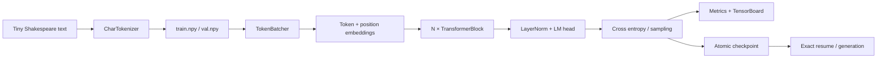

# miniGPT

> CPU-first GPT Training and Profiling Lab
> 从零实现、可复现、可断点续训、可性能分析的字符级 GPT 工程。

**Python 3.14 only · PyTorch CPU · Windows-first · Strict typing · Reproducible training**

## 项目概览

miniGPT 是一个面向学习、工程实践和简历展示的字符级 GPT 项目。它没有调用现成的
Transformer 模型，而是从张量运算开始实现 LayerNorm、因果多头自注意力、MLP、
Transformer Block、语言模型损失与自回归采样，并把数据、训练、断点恢复、指标、
TensorBoard、基准测试和 PyTorch Profiler 串成一条可验证的工程链路。

项目优先解决三个问题：

- **模型原理可解释**：关键网络结构均在 `src/minigpt/` 内实现，张量形状与因果遮罩清晰可查。
- **实验可以复现**：配置、模型、优化器、训练步数和 Python/NumPy/PyTorch/batcher RNG
  都进入 checkpoint。
- **性能可以测量**：基准测试区分预热与计时，输出重复测量、吞吐、离散程度和内存；
  Profiler trace 可以在 Chrome Trace 或 Perfetto 中检查算子级时间线。

当前范围是单机 CPU、字符级 tokenizer 和教学规模 GPT。它不是分布式训练框架，也不以
替代成熟 LLM 训练栈为目标。

## English Summary

miniGPT is a CPU-first character-level GPT training lab implemented with PyTorch. It includes a
hand-written Transformer stack, deterministic data preparation, YAML-driven experiments, exact
checkpoint resume, JSONL metrics, TensorBoard logging, repeatable CPU benchmarks, and PyTorch
Profiler traces. The repository is intentionally small enough to study end to end while keeping
production-minded boundaries: Python 3.14, strict static typing, explicit serialization validation,
and four local quality gates.

## 功能与边界

已实现：

- 字符词表构建、encode/decode、90/10 数据切分及 SHA-256 元数据。
- 自定义 LayerNorm、causal self-attention、MLP、pre-norm residual blocks。
- AdamW 参数分组、线性 warmup、余弦衰减和梯度裁剪。
- 验证集评估、定期采样、JSONL 指标与 TensorBoard。
- 模型、优化器、配置、step 和全部 RNG 状态的精确 checkpoint。
- 训练恢复、独立生成 CLI、CPU benchmark 和 operator profiler。
- Ruff `ALL`、basedpyright `all` 与严格 pytest。

明确不包含：

- GPU/CUDA、混合精度、DDP/FSDP 或多机训练。
- BPE/SentencePiece tokenizer、预训练权重下载或聊天微调。
- 面向生产服务的推理 API。

## 环境要求与安装

- Windows 11 / PowerShell（代码本身尽量保持平台无关）。
- **Python 3.14.x**；`pyproject.toml` 会拒绝 3.13 及更早版本。
- CPU 版 PyTorch 2.12 或项目声明的兼容版本。

```powershell
python --version
python -m pip install -e ".[dev]"
python -m pip check
```

依赖全部定义在 `pyproject.toml`；空的 `requirements.txt` 不是安装入口。发行包名是
`minitrain-gpt`，Python import 名是 `minigpt`。

## Quick Start

五分钟 smoke 流程：

```powershell
python prepare_data.py --data-dir data
python train.py --config configs/char_gpt_smoke.yaml
python generate.py --checkpoint checkpoints/smoke/latest.pt --prompt "ROMEO:" --max-new-tokens 16 --seed 1337
```

对应的轻量配置见
[训练 smoke 配置](configs/char_gpt_smoke.yaml)；第一次运行数据命令会下载 Tiny
Shakespeare，之后复用 `data/raw/input.txt`。

## 数据准备

```powershell
python prepare_data.py --data-dir data
python prepare_data.py --help
```

CLI 调用 `minigpt.data.prepare_tiny_shakespeare`，生成：

```text
data/
├── raw/input.txt
└── processed/
    ├── train.npy
    ├── val.npy
    ├── tokenizer.json
    └── metadata.json
```

为了离线测试，也可以传入本地 `file://` URL：

```powershell
python prepare_data.py --data-dir data/local --source-url "file:///D:/corpus/input.txt"
```

## 训练、恢复与生成

完整训练：

```powershell
python train.py --config configs/char_gpt.yaml
```

短训练：

```powershell
python train.py --config configs/char_gpt_smoke.yaml
```

从 checkpoint 继续，并覆盖总步数：

```powershell
python train.py --config configs/char_gpt_smoke.yaml --resume checkpoints/smoke/latest.pt --max-steps 4
```

生成文本：

```powershell
python generate.py --checkpoint checkpoints/smoke/latest.pt --prompt "ROMEO:" --max-new-tokens 64 --temperature 0.8 --top-k 20 --seed 1337
```

checkpoint 使用临时文件后原子替换，保存模型和优化器 state dict、解析后的 YAML 配置、
当前 step、torch RNG、Python RNG、NumPy 全局 RNG，以及训练/验证 batcher 的独立 RNG。
恢复后从 `saved_step + 1` 开始，因此不会重复已有 metrics step。

## TensorBoard 与训练产物

```powershell
tensorboard --logdir outputs/smoke/tensorboard
```

默认 smoke 训练会写入：

- `outputs/smoke/metrics.jsonl`：loss、learning rate、step timing、tokens/s、RSS。
- `outputs/smoke/samples.txt`：按配置周期生成的文本。
- `outputs/smoke/tensorboard/`：TensorBoard event files。
- `checkpoints/smoke/latest.pt`：最新可恢复 checkpoint。

这些运行产物均被 `.gitignore` 排除，避免把本机实验结果误提交为源码。

## 配置说明

[完整训练配置](configs/char_gpt.yaml) 分为五个部分：

| Section | 作用 |
|---|---|
| `runtime` | seed、CPU 线程数和设备 |
| `data` | token 文件目录、block size、batch size |
| `model` | layer/head/embedding/dropout/bias |
| `optimizer` | AdamW、学习率范围、betas、weight decay、grad clip |
| `training` | 总步数、评估/日志/checkpoint/sample 周期和输出目录 |

`model.vocab_size` 可以为 `null`，训练时会从 `tokenizer.json` 解析并校验；checkpoint
保存的是已经解析的完整配置。

## 核心架构



每个 TransformerBlock 使用 pre-norm：

```text
x = x + CausalSelfAttention(LayerNorm(x))
x = x + MLP(LayerNorm(x))
```

注意力遮罩注册为 non-persistent buffer；checkpoint 不重复存储可由配置重建的下三角矩阵。

## 性能分析

### Benchmark

运行完整矩阵或 smoke 矩阵：

```powershell
python benchmark.py --config configs/benchmark.yaml
python benchmark.py --config configs/benchmark_smoke.yaml
```

[benchmark smoke 配置](configs/benchmark_smoke.yaml) 使用 1/4 线程、32/64 序列长度、
batch size 2 和 small 模型。每个 case 先预热，再重复计时；计时区域包含数据准备、
forward/backward 和 AdamW step，不包含模型构造、日志和文件 I/O。报告同时保留原始
repeat 数据与 median、population standard deviation、MAD、CV。

### PyTorch Profiler

```powershell
python profile_model.py --config configs/benchmark_smoke.yaml
```

Profiler trace 位于配置的 report 目录，可用 `chrome://tracing` 或 Perfetto 打开。
自定义 scope 包括 `data_preparation`、`forward_backward` 和 `optimizer_step`，便于把
Python 训练阶段与底层 operator 对齐。

### Smoke benchmark 结果

以下数据来自一次本机 smoke run：Python 3.14.5、PyTorch 2.12.1+cpu、Windows 11、
Intel Core i7-14700（20 physical / 28 logical cores）。

| Case | Params | Median ms | Tokens/s | CV % | RSS MiB |
|---|---:|---:|---:|---:|---:|
| small-t1-b2-s32 | 108,992 | 4.577 | 14,010.0 | 4.28 | 290.9 |
| small-t1-b2-s64 | 111,040 | 5.596 | 22,880.4 | 1.49 | 292.8 |
| small-t4-b2-s32 | 108,992 | 4.311 | 14,937.0 | 7.86 | 292.9 |
| small-t4-b2-s64 | 111,040 | 4.932 | 25,956.4 | 0.70 | 293.7 |

观察：

- 本次样本中 `small-t4-b2-s64` 吞吐最高，为 25,956.4 tokens/s。
- 长序列提高每个 step 的总时延，但也提高单位时间处理的 token 数。
- 4 线程对 64-token case 的收益更明显；32-token case 的 CV 较高，需要更多 repeats
  才适合做细粒度回归判断。
- RSS 随 case 仅小幅变化，但这里是极小模型，不能外推到大模型内存曲线。

结果不是跨机器排名。CPU 温度、功耗策略、后台负载、PyTorch/BLAS 版本和重复次数都会
显著影响数字；评估优化时应在同一机器、同一电源策略下重复运行。

### Smoke 训练证据

初始 2-step smoke run 的 loss 从 `4.3636` 下降到 `4.2493`，验证 loss 从 `4.2396`
到 `4.2283`；随后从 checkpoint 恢复并延长到 step 3，metrics 保持 `[0, 1, 2, 3]`
连续且无重复。两步 smoke 仅证明链路可运行和恢复状态一致，不代表模型已经收敛。

## 项目结构

```text
miniGPT/
├── configs/                 # 训练、benchmark 与 smoke YAML
├── docs/superpowers/        # 阶段设计与实施计划
├── src/minigpt/
│   ├── data.py              # tokenizer 与数据准备
│   ├── batching.py          # 可恢复随机 batcher
│   ├── layers.py            # LayerNorm / attention / MLP / block
│   ├── model.py             # GPT forward 与 generation
│   ├── optimization.py      # seed / AdamW / LR schedule
│   ├── checkpoint.py        # 原子 checkpoint 与 RNG 恢复
│   ├── trainer.py           # 训练编排与可观测性
│   └── benchmark_*.py       # benchmark、报告与 workload
├── tests/
├── prepare_data.py
├── train.py
├── generate.py
├── benchmark.py
└── profile_model.py
```

阶段 5 的设计与实施依据见
[设计说明](docs/superpowers/specs/2026-07-02-stage5-readme-quality-design.md) 和
[实施计划](docs/superpowers/plans/2026-07-02-stage5-readme-quality.md)。

## 质量门禁与验证

必须使用 Python 3.14，并按以下顺序执行：

```powershell
ruff format src tests
ruff check src tests
basedpyright
pytest
```

额外验证根 CLI：

```powershell
python prepare_data.py --help
python train.py --help
python generate.py --help
python benchmark.py --help
python profile_model.py --help
```

测试遵循 Given/When/Then 结构；网络相关测试用 `file://` 本地语料，不依赖真实 HTTP。

## Roadmap

- 增加 KV cache，对比缓存前后的生成吞吐和算子 trace。
- 增加 BPE tokenizer，并保持 checkpoint/tokenizer 版本兼容。
- 增加 mixed precision 与 CUDA benchmark，同时保留 CPU baseline。
- 增加梯度累积、数据加载 worker 和更长训练实验。
- 建立 CI 矩阵；当前仓库的完成信号仍是本地四道门禁。

## Resume

中文简历描述：

- 从零实现字符级 GPT，包括自定义 LayerNorm、因果多头自注意力、MLP、残差
  Transformer Block、交叉熵训练与 temperature/top-k 自回归采样。
- 设计可精确恢复的训练系统，原子保存模型、AdamW、配置、step 及
  Python/NumPy/PyTorch/数据采样 RNG 状态，避免断点续训重复 step。
- 构建 CPU 性能工程链路，使用重复 benchmark、吞吐/CV/RSS 指标与 PyTorch Profiler
  scope 定位数据、前反向和优化器阶段开销。
- 在 Python 3.14 下执行 Ruff `ALL`、basedpyright `all` 和严格 pytest 门禁，并对
  YAML/JSON/checkpoint 第三方边界做运行时验证与静态类型隔离。

English resume bullets:

- Implemented a character-level GPT from first principles in PyTorch, including custom
  normalization, causal multi-head attention, feed-forward blocks, autoregressive loss, and
  temperature/top-k sampling.
- Built exact-resume checkpointing for model, AdamW, configuration, step, and independent
  Python/NumPy/PyTorch/data-sampler RNG states with atomic file replacement.
- Created a repeatable CPU performance workflow with warmups, repeated measurements,
  throughput/CV/RSS reporting, and PyTorch Profiler scopes for data, forward/backward, and
  optimizer phases.
- Enforced Python 3.14 quality gates with Ruff ALL, basedpyright all, strict pytest, and typed
  validation at YAML, JSON, tensor, and checkpoint boundaries.
