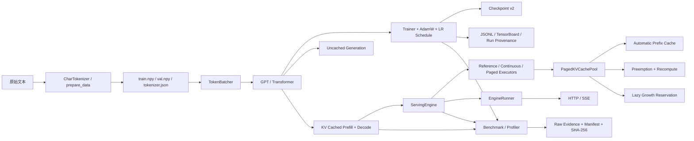

# miniGPT：面向 CPU 的 GPT 训练、推理与服务系统演进

## 摘要

miniGPT 是一个以 **CPU-first、correctness-first、evidence-first** 为核心原则的 GPT 工程实验室。项目从字符级 tokenizer 和手写 Transformer 起步，逐步建立可精确恢复的训练系统、隔离式 CPU benchmark、显式 KV cache、自回归推理、多请求 serving 控制面、张量级 continuous batching、OpenAI-compatible HTTP/SSE 服务、分页 KV 管理、Automatic Prefix Caching，以及面向 KV 压力的抢占和 lazy reservation。

该项目的重点不只是“实现一个能训练和生成文本的小型 GPT”，而是研究一个模型系统如何从算法原型演进为具有明确状态机、资源所有权、错误隔离、跨平台质量门禁和可审计证据链的完整工程。每个后续 Stage 都尽量把功能语义、性能结论和范围边界分开：正确性由 deterministic tests、reference equivalence 和资源 invariant 支撑；性能由 fresh-process raw evidence、环境身份和 strict comparison policy 支撑；无法建立严格结论时，报告会明确标记为 `not_comparable`、`fail` 或 `descriptive_only`，而不是把局部计时差异升级为普遍性能声明。

**关键词：** GPT；Transformer；CPU 训练；精确断点恢复；KV Cache；Continuous Batching；Paged KV Cache；Automatic Prefix Caching；请求抢占；Lazy Reservation；可复现实验；证据链

---

## 1. 项目背景与动机

大型语言模型的核心结构并不复杂：token embedding、位置编码、因果自注意力、前馈网络、残差连接和自回归采样即可组成一个最小 GPT。然而，真正可靠的模型系统还需要回答一组远比“forward 是否能运行”更困难的问题：

1. 中断后继续训练时，模型、optimizer、数据批次和随机序列是否与不中断运行完全一致？
2. benchmark 数字是否来自隔离进程、同一环境和可复核的原始样本，而不是一次偶然计时？
3. 多请求推理时，请求状态、FIFO、公平性、取消、失败和 KV 资源所有权是否明确？
4. cache、prefix sharing、分页存储和抢占是否会改变 learned absolute-position 语义或每请求 RNG？
5. 性能优化若未带来稳定 wall-clock 收益，系统是否仍能诚实地区分“减少了模型工作”和“已经证明更快”？

miniGPT 以这些问题为主线。它坚持在单机 CPU、小模型和 Python/PyTorch reference implementation 的范围内，把训练、推理、serving 和 evidence 的关键控制逻辑显式化。这样既便于学习 GPT 的底层原理，也便于研究现代推理系统中的调度、缓存和资源管理问题。

项目当前不是面向大规模生产部署的通用 LLM 平台。它不包含 CUDA fused kernels、分布式训练、张量并行、LoRA、量化、BPE、CPU swap 或 speculative decoding。相反，它提供一个规模受控但语义严格的实验基座，使每一次扩展都可以与上一阶段 reference 行为比较。

---

## 2. 总体目标、定位与范围

### 2.1 总体目标

miniGPT 的目标可以概括为四层：

- **模型层：** 从基础 PyTorch 张量和模块构建字符级 GPT，保持因果性、位置语义、loss 和采样行为可测试。
- **训练层：** 建立可恢复、可观测、可复现的 CPU 训练运行时，严格绑定配置、数据身份和随机状态。
- **推理与服务层：** 从单请求 KV cache 演进到多请求调度、continuous batching、HTTP/SSE、paged KV、prefix sharing、抢占和 lazy growth。
- **证据层：** 为功能和性能结论保存 raw evidence、环境、配置、来源 commit、artifact membership 和 SHA-256，阻止结果与代码脱钩。

### 2.2 CPU-first 的含义

CPU-first 并不表示项目假定 CPU 比 GPU 更适合大模型，而是表示：

- reference workload 能在普通开发机上复现；
- 不依赖 CUDA 环境即可研究状态、缓存、调度和证据协议；
- benchmark 显式记录 thread count、CPU、toolchain、affinity 和环境变量；
- 所有 GPU-specific 优化都必须作为独立阶段引入，不能悄悄改变 CPU baseline。

### 2.3 明确的范围边界

当前范围包括：字符级 tokenization、单机 CPU 训练、AdamW、cosine schedule、checkpoint v2、文本生成、KV cached inference、多请求 serving、OpenAI-compatible completions subset、SSE、paged KV、APC、chunked prefill、whole-request preemption 和 lazy reservation。

当前范围不包括：

- BPE/SentencePiece 等子词 tokenizer；
- CUDA、mixed precision、fused attention 或真正的高性能 PagedAttention kernel；
- 多机、多卡或分布式 checkpoint；
- CPU/GPU swap、partial-block copy-on-write；
- speculative decoding、beam search、量化；
- 动态优先级、租户配额或面向公网的完整 API 安全体系。

---

## 3. 系统总体架构



系统的关键设计是把 **计算**、**控制面**、**存储所有权** 和 **证据** 分离：

- `GPT` 和 executor 负责模型计算，但不自行决定请求生命周期；
- `ServingEngine` 负责 FIFO、状态转换、预算和资源决策；
- `PagedKVCachePool` 负责 block table、private/shared ownership、reservation 和 rollback；
- `EngineRunner` 是 HTTP 场景下唯一调用 engine/model 的 owner thread；
- benchmark/evidence 模块不修改生产语义，只观察并保存可验证结果。

---

## 4. 核心模块

### 4.1 数据与 tokenizer

`src/minigpt/data.py` 和 `prepare_data.py` 实现字符级 `CharTokenizer`、编码/解码、训练/验证数据准备及严格文件边界。处理结果包括 `tokenizer.json`、`train.npy` 和 `val.npy`。字符级 tokenizer 使词表和可逆性直观可见，但也意味着序列较长，不代表现代生产 LLM 常用的子词方案。

`src/minigpt/batching.py` 提供可恢复的 `TokenBatcher`。batcher 拥有独立随机状态，训练 checkpoint 可以恢复“下一批 token”而不只是模型参数。Stage 8 后，其数据路径支持只读 mmap 和更少的中间分配，同时保留数组所有权、边界和采样等价合同。

### 4.2 GPT 模型与基础层

`src/minigpt/layers.py` 包含手写 LayerNorm、causal multi-head self-attention、MLP 和 Transformer block；`src/minigpt/model.py` 负责 token/position embedding、block 堆叠、logits、交叉熵 loss、prefill、decode 和自回归 generation。

模型使用 learned absolute positions。该选择直接影响后续 serving 设计：当上下文超过 `block_size` 时，不能简单平移旧 KV 的位置语义，而要对滑动窗口做 dense re-prefill；APC 也必须把 prefix 身份绑定到绝对逻辑历史，抢占恢复不能盲目重新挂接原 prompt 位置的 shared blocks。

### 4.3 优化器、学习率与训练运行时

`src/minigpt/optimization.py` 集中管理全局 seed、AdamW 构造、梯度裁剪和学习率计划。Stage 6 将完整实验的 `max_steps`、cosine horizon 的 `lr_decay_steps` 与单次进程退出边界 `run_until_step` 分离，避免临时停止改变后续学习率或 validation/sample 时序。

`src/minigpt/trainer.py` 编排 batch、forward/backward、optimizer step、validation、sample、checkpoint 和指标。训练采样使用独立 `torch.Generator`，不会污染 dropout 或下一步训练的全局 RNG 轨迹。

### 4.4 Checkpoint v2 与 exact resume

`src/minigpt/checkpoint.py` 使用版本化、运行时校验和原子替换的 checkpoint。v2 保存：

- 模型和 optimizer state；
- 完整 resolved config；
- `completed_step`；
- Python、NumPy、PyTorch RNG；
- train/validation batcher RNG；
- sample generator RNG；
- tokenizer、train、val 文件 SHA-256。

恢复流程先比较配置和数据身份，再修改任何 mutable state。v1 可继续加载模型和生成文本，但被明确禁止用于训练恢复。自动化测试比较 uninterrupted 与 interrupted/resumed 运行的每个模型 tensor、optimizer 状态、下一批 token、后续 sample、学习率和 loss。

### 4.5 指标、provenance 与 profiling

训练输出 JSONL 和 TensorBoard 指标，并记录 loss、学习率、step time、tokens/s、RSS 等。wall-clock 和系统指标天然波动，不属于 exact-resume 数值等价条件。

PyTorch Profiler 使用独立入口和命名 scope 定位 data、forward/backward、optimizer 等阶段。Profiler instrumentation 会改变时间，因此 profiler 结果用于解释热点，不作为 canonical throughput 样本。

### 4.6 Benchmark v1、v2 与比较策略

v1 保留为历史 smoke 接口。Benchmark v2 则建立了更严格的方法学：

- 每个 replicate 使用 fresh process；
- 保存 resolved config、case identity、环境、worker PID、raw samples 和失败上下文；
- 随机化或交错执行次序，降低固定顺序偏差；
- 使用 median、MAD、CV 和 minimum replicate 规则；
- 比较时由独立 policy 重新计算稳定性和 verdict；
- 拒绝 CPU、toolchain、环境变量、methodology 或样本数量不兼容的证据。

`compare_benchmarks.py` 的 `pass`、`fail` 和 `not_comparable` 是不同结论。`not_comparable` 仍可展示 descriptive delta，但不能被解释为通过或回归。

### 4.7 KV cached inference

Stage 9 将 generation 分为 prompt `prefill` 和单 token `decode`，每层显式返回 KV cache。普通窗口内只计算新 token；超过 learned-position 窗口时，系统重建实际滑动上下文。推理 benchmark 将 cached 与 uncached 模式放入独立进程，使用固定权重、forced tokens 和可复核环境比较。

### 4.8 Serving 控制面

`src/minigpt/serving.py` 是项目后半段的核心。它定义：

- `WAITING`、`PREFILLING`、`DECODING`、`PREEMPTED`、`RECOMPUTING` 和终态；
- FIFO waiting/active 集合；
- admission、cache reservation、取消和失败隔离；
- per-request `torch.Generator`；
- TTFT、TPOT、queue time、E2E、throughput 和资源指标；
- tick 内 cancellation、admission、prefill/decode、pressure handling 的确定性顺序。

`src/minigpt/serving_simulator.py` 使用严格 YAML schema 和逻辑时钟运行固定 workload，输出事件、请求 CSV、summary 和 timeline。它用于语义和调度证据，不把逻辑时间冒充真实性能。

### 4.9 Executors 与 continuous batching

项目保留多种 executor 作为演进 reference：

- `ReferenceExecutor`：逐请求 prefill/decode；
- `ContinuousDecodeExecutor`：prefill 逐请求、decode 对 variable-length dense cache 做 batch assembly/scatter；
- `ContinuousExecutor`：进一步提供 length-aware batched prefill；
- `PagedAttentionExecutor`：普通 decode 直接读取 ordered physical block views，避免历史 KV compact materialization；
- APC/Stage 15 路径：对 `paged history + variable new segment` 做 cache-aware suffix batching。

每个 request 仍独立 sampling，batch composition 不得改变 RNG 调用次序或错误隔离。

### 4.10 HTTP、SSE 与单 owner 执行

`src/minigpt/engine_runner.py` 通过线程安全 command queue 把 async HTTP 请求交给唯一 owner thread。`src/minigpt/http_server.py` 和 `serve.py` 提供 `GET /healthz`、`GET /v1/models` 和 OpenAI-compatible `POST /v1/completions` 子集。

流式输出通过有界 channel 发送 SSE；慢消费者溢出、disconnect 或显式取消只影响对应请求。HTTP 层不直接并发调用模型，避免 event loop、模型状态和 cache pool 出现多 owner 竞态。

### 4.11 Paged KV Cache

`src/minigpt/paged_kv_cache.py` 管理固定 physical K/V block pool 和 per-request block table。它显式区分 `FREE`、`PRIVATE` 和 `SHARED` block，并在每次 mutation 后验证：

- free/resident 集合完整且互斥；
- private block 只属于一个 request；
- shared active refcount 与 request-table 引用一致；
- allocation 不超过 reservation；
- partial tail 保持 private；
- 失败 rollback 恢复 block metadata、tensor、free heap、prefix index 和计数器。

Stage 13B 的实现仍是 Python/PyTorch reference，不是 CUDA fused PagedAttention。

### 4.12 Automatic Prefix Caching

Stage 14 的 APC 对 complete token blocks 建立 namespace-bound hash chain。namespace 包含 checkpoint、model config、dtype/device、block size、schema 和 position semantics；每个 block hash 还绑定 parent history，并保留 token metadata 做 collision defense。

命中时，request table 引用 immutable canonical `SHARED` blocks；未命中 suffix 单独计算并在 final prefill 后事务化 promotion。zero-ref shared blocks可按 deterministic LRU 淘汰，active shared blocks不可淘汰。partial tail 不共享，也没有 COW。

### 4.13 Chunked Prefill 与 token budget

Stage 16 为每个 engine tick 增加实际 model-token budget：普通 decode 计 1，overflow dense rebuild 按实际上下文长度计费，prefill chunk 按实际 chunk tokens 计费，exact APC hit 计 0。无法装入剩余预算的工作必须延后，不能先执行再记账。

长 prompt 被拆成 block-aligned intermediate chunks 和可能较短的 final chunk。intermediate chunk 不 sampling、不推进 RNG、不发 token；最终 chunk 才产生首 token。公平性 cursor 在高成本 decode 和 prefill 之间做确定性交替。

### 4.14 KV 压力抢占与 recompute resume

Stage 17 在 full-reservation 模型上建立 whole-request preemption 闭环。只有本 tick 成功 decode 的 `DECODING` request 可被普通 waiting-head pressure 抢占；victim 释放 private blocks、APC active refs、reservation、dense pointer 和 intermediate logits，然后回到 waiting tail。

恢复时不重挂原 APC prompt blocks，而是对 `all_tokens[:-1][-block_size:]` 做 cache-only dense recompute。recompute 不 sampling、不推进 RNG，并按实际 history tokens 计入 Stage 16 budget。Stage 17 hotfix 进一步保证：单请求本身永远无法满足 logical budget 或 physical pool 的 waiting head 会立即失败，绝不会通过无意义抢占伤害正常 decoder。

### 4.15 Lazy KV Growth Reservation 与受控 overcommit

Stage 18 将“full lifetime demand”和“current protected capacity”分离：

- 新请求 admission 只保护当前 prompt cache；
- PREEMPTED request 恢复时只保护 recompute history；
- full lifetime demand 仍作为每请求 immutable 上限；
- aggregate lifetime demand 受 `kv_overcommit_ratio` 限制；
- 每次 `DECODING` 或 `RECOMPUTING` 模型工作前，logical token reservation 和 physical block protection 必须先增长成功。

若 growth 失败，模型不执行，请求 token、RNG、cache 和 lifecycle 均不推进。scheduler 记录 blocked request/target，并可抢占另一个 decoder；释放后立即无模型工作的重试 growth，避免 victim 下一个 tick 重新入驻并抢回容量。legacy full reservation 仍是默认行为，Stage 18 是 opt-in reference feature。

### 4.16 真实服务配置与 Runtime Manifest

Stage 19 将 Stage 15–18 的可选策略接入真实 HTTP 进程。`serve.py` 仍是兼容入口，但参数解析与
runtime 构造集中在 `src/minigpt/serving_runtime.py`：APC batching、token-budget chunking、KV
preemption、lazy reservation 和 overcommit 必须满足与 simulator 相同的严格组合合同。

可选 runtime manifest 在 engine/allocator/runner 成功构造后原子写入，绑定 checkpoint 与 tokenizer
SHA-256、模型配置、线程数、executor、paged pool、scheduler 和 runner。manifest 不含输入绝对路径、
时间戳、PID 或环境变量，因此同一输入产生稳定字节，可直接纳入 evidence hash。HTTP completion
request schema 保持不变，Stage 19 也不把配置 wiring 描述成性能提升。

### 4.17 统一 CLI 与 Project Doctor

Stage 20 提供 `minigpt` / `python -m minigpt` 单一安装入口，并保持原有脚本 parser 为各命令的语义来源。命令模块按需导入，因此 help/version 不依赖 HTTP extras。

Project doctor 通过显式 Stage 7A–20 registry 验证 package membership、SHA-256、stage-specific contract 和 source provenance。对历史 squash merge，registry 必须显式记录 reviewed source SHA 与进入 `main` 的 merge SHA；`quick` 模式检查静态 release contracts，`ci` 模式还执行 Stage 18 canonical simulation、Stage 19 real runtime smoke 和 installed CLI subprocess。输出 JSON 固定使用相对 repository identity，不记录机器路径或 timing。


### 4.18 v1.0 Release Closure（Stage 21）

Stage 21 将项目从“功能完整的 repository”收口为“可安装、可审计、可发布的 v1.0.0”。版本由 `minigpt._version` 单一来源提供，setuptools 动态读取；generated egg-info 不提交。Release validator 构建 wheel/sdist、检查 package 和 root command modules，在不继承源码 `PYTHONPATH` 的 fresh venv 安装 wheel，并交叉验证 distribution metadata、`minigpt.__file__` 安装位置、module/console help/version、`pip check` 和 installed quick doctor。

v1 capstone evidence 汇总 Stage 7A–20 registry、release doctor、Stage 18 canonical simulation、Stage 19 real runtime、checkpoint v2 exact resume、release lifecycle、全量 pytest partitions 和质量门禁。Stage 21 自身不加入 doctor registry，以避免 verifier 对自身 package 形成循环信任；capstone verifier 会检查内部命令记录、测试集合、计数、claim policy、exact membership/hash，在非 shallow 仓库中验证 source ancestry，并要求每个已提交 `tests/test_*.py` 恰好被 full-suite partitions 覆盖一次。

---

## 5. Stage 1–21 演进

> Stage 5 以后有正式 design/plan/evidence 文档。Stage 1–4 没有同样格式的阶段规格，下面的命名依据早期 Git 提交顺序与现有代码职责归纳，不把未记录的验收数字写成事实。

| Stage | 主题 | 主要交付与意义 |
|---|---|---|
| 1 | 工程骨架与依赖 | 建立 `src` 布局、配置、CLI、测试和 PyTorch CPU 项目基础。 |
| 2 | 字符级 tokenizer 与数据 | 实现 `CharTokenizer` encode/decode、Tiny Shakespeare 数据准备和对应测试。 |
| 3 | 手写 GPT | 实现 token/position embedding、causal attention、MLP、Transformer blocks、loss 和 generation。 |
| 4 | 可恢复 CPU 训练与初始性能分析 | 建立 batcher、AdamW、训练循环、checkpoint、JSONL/TensorBoard、CPU benchmark 和 profiler 基线。 |
| 5 | 文档与质量收口 | 对 README、CLI、配置和质量门禁做系统整理，形成可运行、可读的工程基线。 |
| 6 | Correctness & Portability Hardening | 支持 Python 3.11–3.14；恢复惯用 `nn.Module.__call__`；隔离 sampling RNG；实现 checkpoint v2、数据身份校验、exact resume 和 Windows/Linux CI。 |
| 7A | Reference Training Evidence | 固化 CPU reference training 配置、分段恢复来源、环境、指标和 hash-bound 训练证据。 |
| 7B | CPU Benchmark v2 | 建立 fresh-process benchmark、case/methodology identity、raw replicate、环境兼容检查、strict policy 比较和独立 profiler。 |
| 8 | Batcher / mmap 优化 | 优化 `TokenBatcher` 的 mmap 数据路径，并用 batch-only 隔离 benchmark 验证；严格结果因稳定性不足保持 `not_comparable`。 |
| 9 | KV-cache Generation | 增加 per-layer KV cache、prefill/decode、overflow re-prefill、cached generation 和隔离推理 benchmark。 |
| 10 | Serving Control Plane | 实现请求状态机、FIFO、admission/reservation、取消、失败隔离、per-request RNG、deterministic simulator 和服务指标。 |
| 11A | Decode Continuous Batching | 对 variable-length dense cache 做 batch assembly/scatter，一次推进多请求单 token decode；保留逐请求 prefill。 |
| 11B | Length-aware Batched Prefill | 增加按 FIFO 连续前缀和 padding bounds 的 batched prompt prefill，并做三 executor 等价验证。 |
| 12 | HTTP / Streaming Serving | 提供 completions API 子集、SSE、单 owner `EngineRunner`、有界背压、disconnect cancellation 和 localhost system benchmark。 |
| 13A | Paged KV Cache Manager | 实现固定 block pool、request block tables、reservation、事务化 prefill/append/rebuild、碎片与回收 stress。 |
| 13B | Block-aware Paged Attention | 普通 decode 直接遍历 physical block views，消除历史 KV materialize；保持 dense prefill/overflow reference。 |
| 14 | Automatic Prefix Caching | 实现 namespace-bound hash chain、shared immutable blocks、refcount、promotion、collision defense 和 LRU eviction。 |
| 15 | Cache-aware Batched Paged Prefill | 对 APC suffix 使用 `paged history + variable new segment` 批处理，同时跳过 cached-prefix Transformer work；benchmark 未证明 wall-clock 提升，sequential 仍为默认。 |
| 16 | Chunked Prefill & Token Budget | 对长 prompt 分块，按实际 model work 计费，提供 decode/prefill fairness，并清理终态 intermediate logits。 |
| 17 | KV-pressure Preemption | 实现 whole-request preemption、资源释放、无采样 recompute resume、RNG 等价和 learned-position overflow 等价；hotfix 阻止 intrinsically impossible head 误触发抢占。 |
| 18 | Lazy KV Reservation | admission 只保护当前容量，full lifetime demand 受 bounded overcommit 管理；模型工作前 growth，growth pressure 使用 Stage 17 抢占作为 correctness fallback。 |
| 19 | Production Serving Configuration | 将 Stage 15–18 进程级策略接入真实 HTTP runtime，集中严格验证，并原子输出可复核 runtime manifest。 |
| 20 | Unified CLI + Project Doctor | 提供可安装命令入口、Stage 7A–20 evidence registry、精确 source/squash provenance、config/runtime 自检和 CI gate。 |
| 21 | v1.0 Release Closure | 单一版本源、wheel/sdist 隔离 fresh install、release doctor、结项文档、capstone evidence 与跨平台发布门禁。 |

---

## 6. 正确性、可复现性与证据体系

### 6.1 Reference equivalence

优化路径通常同时运行 reference 与 candidate，并比较：

- generated token 序列；
- 每请求 generator state/hash；
- terminal status；
- FIFO admission 和逻辑事件；
- cancellation/failure 行为；
- cache length、reservation、block ownership 和 final cleanup。

对于 learned absolute positions，测试还覆盖 window overflow；对于 APC，覆盖 hash collision、shared refcount、duplicate promotion、zero-ref eviction 和 private tail；对于 Stage 17/18，覆盖 preemption/recompute、growth blocked、immediate retry、RNG 不推进和 no-starvation。

### 6.2 Deterministic stress

allocator 与 serving stress 使用固定 seed，对 submit、tick、growth、preempt、resume、cancel、finish、failure 和 release 进行长序列 mutation，并在每次 mutation 后运行 invariant。最终必须没有 private ownership、active shared refs、reservation 或 terminal intermediate logits。

### 6.3 Hash-bound evidence

`docs/results/<stage>/` 下的证据包通常包含：

```text
README.md
summary.json
artifact_manifest.json
evidence/
  correctness.json
  scheduling-or-benchmark.json
  stress.json
  lifecycle_tests.json
```

manifest 绑定：

- 精确 artifact membership；
- 每个文件字节数；
- SHA-256；
- reviewed source commit。

verifier 会拒绝文件增删、字节变化、source mismatch、越界性能声明或未通过的 lifecycle。`.gitattributes` 对 evidence 目录固定 LF，避免 Windows/Linux checkout 改变 hash。

### 6.4 Claim policy

项目严格区分四类陈述：

1. **语义正确：** reference equivalence 和 invariant 通过；
2. **结构性优化：** 如 avoided prefill tokens、model calls 减少、materialization 消除、current reservation 降低；
3. **描述性计时：** 当前机器上的中位数或 ratio；
4. **严格性能结论：** 只有 fresh-process、环境兼容、样本稳定且 policy verdict 为 `pass` 时成立。

结构性工作减少不自动等价于 wall-clock speedup。

---

## 7. 当前实验结论

以下结论来自仓库已有 README、summary 和 evidence；它们的适用范围均限于对应配置、机器与方法学：

- Reference training 证据表明 checkpoint v2 的分段恢复可以保持训练轨迹和数据/RNG 状态一致。
- Stage 8 batch-only candidate 在描述性中位数上更低，但 strict comparison 因 CV 门槛失败而为 `not_comparable`，因此不声称稳定提速。
- Stage 9 的 12 个 cached case 描述性 E2E 中位数均较低，但部分 case 不稳定，总体 strict verdict 为 `not_comparable`。
- Stage 11A 的固定小模型六场景满足 correctness 和 CV 门槛，strict verdict 为 `pass`；README 记录的 reference/continuous median wall-time ratio 约为 1.24×–2.22×。这一结论不外推到其他模型或硬件。
- Stage 13B direct paged reference 在 canonical CPU 描述中略慢于 materialized path，因此明确为 `descriptive_only`。
- Stage 14 APC 虽减少实际 prefill work，但 strict benchmark 为 `fail`，没有 wall-clock improvement claim。
- Stage 15 batched APC suffix 减少 model-call count，但 aggregate strict verdict 为 `fail`，所以生产默认仍是 sequential。
- Stage 16、Stage 17 和 Stage 18 的核心声明是调度、资源和等价性；benchmark verdict 均保持 `descriptive_only`，`wall_clock_performance_improvement=false`。

这些结果体现了项目的核心原则：负面或不确定的 benchmark 同样是有效工程证据，因为它阻止优化名义取代实际验证。

---

## 8. 局限与未来工作

### 8.1 当前局限

- 字符级 tokenizer 不适合直接代表现代 LLM 的 token efficiency。
- 模型和 workload 很小，CPU benchmark 不代表大型模型部署结果。
- Paged attention、APC、chunked prefill、preemption 和 lazy reservation 都是 Python/PyTorch reference；Python 调度和逐 block 循环可能掩盖结构性收益。
- APC 只共享 complete blocks，partial tail 没有 COW。
- overflow 使用 dense rebuild，对长窗口成本较高。
- Stage 18 overcommit 是受控 admission/growth policy，不是虚拟内存或 swap；无法生长时仍需要 whole-request recompute。
- HTTP API 只覆盖 completions 子集，未实现认证、限流、multi-model routing 或公网安全。

### 8.2 建议后续方向

1. **BPE 与 tokenizer/version compatibility：** 在保持 checkpoint identity 的前提下引入子词 tokenizer。
2. **Partial-block sharing/COW：** 单独设计尾块写时复制、rollback 和 refcount 语义。
3. **高性能 kernel：** 将 reference block attention 替换为 CPU vectorized 或 CUDA fused kernel，并保留同一 correctness suite。
4. **Swap/offload：** 研究 CPU memory、disk 或异构设备之间的 cache tier，需要新的容量和故障模型。
5. **Speculative decoding：** 增加 draft/target RNG、acceptance 和 rollback 证据。
6. **Adaptive scheduling：** 基于真实长度分布研究 bucket、priority 或 SLO，但不能破坏 FIFO/fairness 的明确合同。
7. **更大规模实验：** 延长 reference training、扩展模型尺寸和硬件矩阵，同时保持 raw evidence 和环境身份。
8. **CI 扩展：** 增加更多 PyTorch/Python 组合和性能专用受控 runner；共享 CI 仍只作为正确性门禁。

---

## 9. 目录、运行入口与建议阅读路径

### 9.1 关键目录

```text
configs/                    训练、benchmark、simulator 与 serving 配置
docs/superpowers/specs/     Stage 设计文档
docs/superpowers/plans/     实施计划
docs/results/               Hash-bound evidence packages
src/minigpt/                模型、训练、推理、serving 与证据实现
tests/                      单元、集成、lifecycle、stress 与 evidence 测试
```

### 9.2 常用入口

```powershell
python prepare_data.py --config configs/char_gpt.yaml
python train.py --config configs/char_gpt.yaml
python generate.py --checkpoint <checkpoint> --prompt "..."

python benchmark_v2.py --config configs/benchmark_v2_smoke.yaml
python benchmark_inference.py --config configs/inference_benchmark_stage9.yaml
python simulate_serving.py --config configs/serving_lazy_kv_reservation.yaml
python serve.py --checkpoint <checkpoint> --tokenizer <tokenizer>
python generate_stage18_evidence.py --source-commit <reviewed-commit>
minigpt verify --mode quick
minigpt verify --mode ci
minigpt verify --mode release --require-clean
```

### 9.3 建议阅读顺序

1. `README.md`：快速安装、训练、benchmark 和 serving 用法；
2. `src/minigpt/layers.py`、`model.py`：GPT 计算图；
3. `trainer.py`、`checkpoint.py`：exact resume；
4. `benchmark_v2*.py`：可复核性能方法学；
5. `serving.py`：请求状态机和调度；
6. `paged_kv_cache.py`：资源所有权与 invariant；
7. Stage 14–21 specs：prefix sharing、chunk budget、preemption、lazy growth、真实 runtime、project doctor 与 release closure；
8. `docs/results/*/summary.json`、独立 verifier 与 `docs/RELEASE_CHECKLIST.md`：理解项目如何约束结论和发布边界。

---

## 10. 结论

miniGPT 展示了一个小型 GPT 项目如何沿着“模型实现—可恢复训练—可复核 benchmark—多请求 serving—分页缓存—资源调度”的路径逐步演进。它最有价值的部分不是某个单独优化，而是每个阶段都尝试保持三条边界：

- reference semantics 不被优化路径悄悄改变；
- 资源状态和失败恢复可由 invariant 解释；
- 性能结论不超过 evidence 能支持的范围。

截至 Stage 21，项目已经形成完整的 CPU reference lab 闭环：Stage 18 完成 serving 资源策略，Stage 19 将策略接入真实 HTTP runtime，Stage 20 提供可安装 CLI 与显式 evidence/provenance 自检，Stage 21 再以隔离 wheel 安装、release doctor 和非自引用 capstone evidence 收口。legacy 路径仍保留为默认 reference，所有优化能力均通过 opt-in 配置、等价测试和 hash-bound evidence 接入。此后 bug fix、依赖兼容和 evidence hardening 进入 patch maintenance；更高性能 kernel、COW、swap、BPE、GPU 或分布式能力必须作为 post-v1 独立研究设计。
