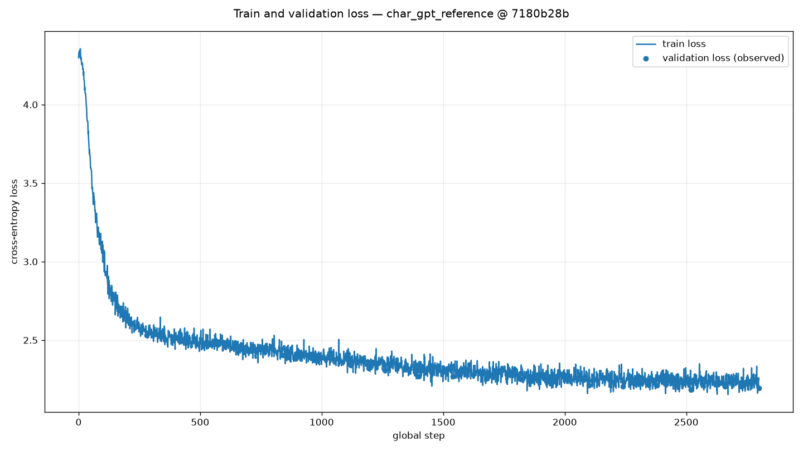
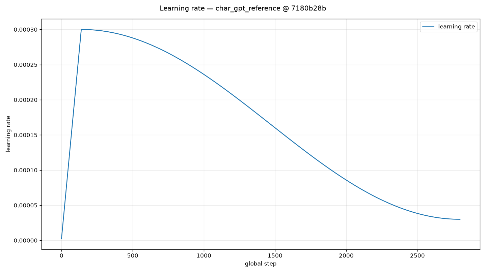
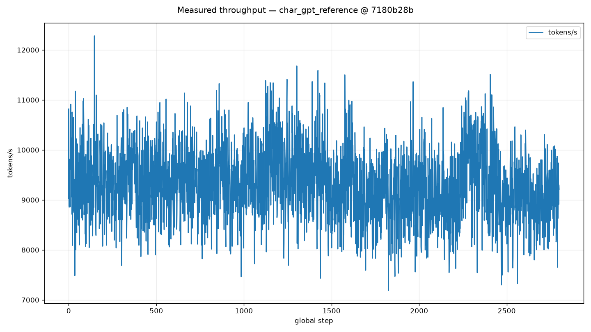

# CPU Reference Training Evidence

This report is generated from validated raw artifacts. Its purpose is to provide a reproducible,
reviewable training example—not a hardware benchmark.

## Experiment identity

- experiment: `char_gpt_reference`
- Git SHA: `7180b28be8c6cc1a6da07ee59821d7c2ef2a5e83`
- clean worktree at training time: `true`
- checkpoint format: v2
- checkpoint: `checkpoints/reference/latest.pt`
- checkpoint SHA-256: `023c344c3ff30fbf7d00f72dc68bed6ddecada57544e27bc8baa228585247ff8`
- checkpoint resume: yes (2 completed process segments)
- resolved config SHA-256: `d422b1cc92d4c1be75a886cfefc7762b02bd1f2da811c3ffdd9a22111a81423d`

## Model and data

- character-level GPT: 4 layers, 4 heads,
  embedding width 128, block size 128
- trainable parameters: 820,608
- vocabulary size: 65
- batch size: 16
- Tiny Shakespeare train tokens: 1,003,854
- Tiny Shakespeare validation tokens: 111,540

## Full training commands

```powershell
python train.py --config configs/char_gpt_reference.yaml --run-until-step 1470 --provenance outputs/reference/run_provenance.json
python train.py --config configs/char_gpt_reference.yaml --resume checkpoints/reference/latest.pt --provenance outputs/reference/run_provenance.json
```

Both processes used the same complete experiment config. The first process ended at its
`--run-until-step` boundary; the second restored checkpoint v2 and completed `max_steps`.

## Results

| metric | initial | final | best |
|---|---:|---:|---:|
| train cross-entropy | 4.299224 | 2.251056 | 2.152922 |
| validation cross-entropy | 2.780932 | 2.193478 | 2.184807 |
| train character perplexity | 73.6426 | 9.4978 | 8.6100 |
| validation character perplexity | 16.1341 | 8.9663 | 8.8889 |

- total optimization steps: 2,800
- median measured tokens/s: 9281.21
- peak process RSS: 486.97 MiB
- validation values are plotted only at their observed scheduled steps







## Generated text

Selection rule: untrained baseline plus **first / middle / final scheduled samples**, using the
configured fixed prompt, sample seed, temperature, and top-k. No sample was selected for fluency.

### Untrained baseline (step -1)

```text
ROMEO:PON'uDR;.itQm l!jY 
etqUbyqx'XNMZP!Qi.J3l:KSh$ycwLjYaB.KP;cuXKz
XV?KLH&uZoY?,pMLZYT&W-l 
XmiHHwznA.kZjBG!N?Pv-faQnN-;qYaTPZuJqPJQ;hJ'g;P;ll$lqHyKzPH;l3svz$OWtlqOGPFUy;zxKtybzooOr'H:T;ZoclI3$TfP;vI3v
P
```

### First scheduled sample (step 279)

```text
ROMEO: whe h sout melain wet ure thanoule inde mathe wigin he, tister hakinthenou and, athist s miershe mlas ced coumedeineswan'sh my gimeng oill l myous the she la wareoure y theve w mouraurele,
Themeanou 
```

### Middle scheduled sample (step 1679)

```text
ROMEO:
Ast toupp, thand, ce deand henker theseang
To row ourd an thig am gair ches'd of you
I and wof angon ith rmin le whereance t canes hy but.

Ford, seat nonem y mend; melo I Ist crtor.


F INTENUS:
Wy 
```

### Final scheduled sample (step 2799)

```text
ROMEO:
Tom by hardig, and he is wof lachears for wered
Thot spom goon thend bly thiin ul hachens
O, with and des mad he.
SSer, shis wowe wame woul, frlandit now my olle lavem is bll beaite
Whis ler tharr th
```

The complete unedited scheduled sample file is [generated_samples.txt](generated_samples.txt).

## Limitations

This is one small CPU-only character-model training run on Tiny Shakespeare. Lower training loss
does not by itself demonstrate generalization, model quality, statistical significance, or
hardware performance. Throughput includes the normal training path and scheduled validation
overhead, so it must not be compared with a dedicated benchmark.

## Reproduce

1. Install `.[dev,report]` and prepare Tiny Shakespeare with
   `python prepare_data.py --data-dir data`.
2. Run the two commands recorded above from Git SHA `7180b28be8c6cc1a6da07ee59821d7c2ef2a5e83`.
3. Run `python report_training.py` with the config, metrics, samples, checkpoint, provenance, and
   a new output directory.
4. Compare source and generated file hashes in
   [artifact_manifest.json](artifact_manifest.json). The checkpoint is intentionally not committed;
   its SHA-256 above binds the report to the retained local binary.
